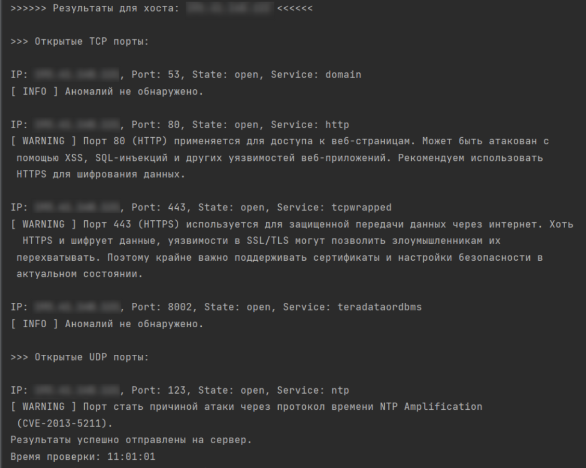

# Концепт VMS-системы

Учебный проект, в рамках которого был создан образ VMS-системы. Так как это не полноценный проект, вся информация выводится в консоль. Проект состоит из двух частей - серверная (server.py) и клиентская (main.py) части. Серверная часть запускается с командной строки командой `python server.py` из директории с проектом.

Предполагалось, что данная VMS-система должна быть направлена на сканирование открытых портов и вывод предупреждений, чем может быть опасен найденный порт. В рамках учебного проекта было выполнено поверхностное сканирование заранее подготовленной уязвимой системы. Возможно усовершенствование функционала для применения его в реальных проектах.

**Пример работы программы:**

